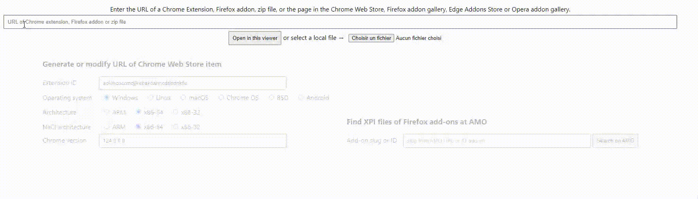

[![Contributors][contributors-shield]][contributors-url]
[![Forks][forks-shield]][forks-url]
[![Stargazers][stars-shield]][stars-url]
[![Issues][issues-shield]][issues-url]

<!-- PROJECT LOGO -->
 

  

<h3 align="center">TI Connect CE Browser</h3>

  

    A patched version of TI Connect CE for Chrome OS that works in the browser without installing anything
     
    <a href="https://latealways.is-a.dev/ticonnectce/">View Demo</a>
    ·
    <a href="https://github.com/LateAlways/ti-connect-ce-browser/issues">Report Bug</a>
  

<!-- TABLE OF CONTENTS -->

Table of Contents

<ol>
  <li>
    <a href="#about-the-project">About The Project</a>
  </li>
  <li>
    <a href="#getting-started">Usage</a>
  </li>
  <li><a href="#contributing">Contributing</a></li>
  <li><a href="#contact">Contact</a></li>
  <li><a href="#legal">Legal</a></li>
</ol>

<!-- ABOUT THE PROJECT -->
## About The Project

In most schools nowadays, students use chromebooks. These chromebooks are usually locked down so you can't install games and other non-school related stuff. I believe this app should always have been available online the same way it is already for the TI-Nspire™ CX II. (https://nspireconnect.ti.com/nsc/) As a student myself, I found it pretty hard to find a program that works exactly the same as [TI Connect CE](https://education.ti.com/en/products/computer-software/ti-connect-ce-sw) The app most similar to a website was of course the one on the webstore so I went ahead, downloaded it and started patching everything. It works by emulating the environment of a platform app in a browser.

There MAY be some bugs so USE AT YOUR OWN RISK.

## Usage

For the install process (putting it on a webserver) the Automatic installation requires python code execution with access to the system.

If you are using a chromebook, you can either use the demo from above or follow the Manual installation.

### 1. Manual installation - Download extension files and patch files manually.
1. Download the source code of the [TI Connect CE App for Chrome OS](https://chromewebstore.google.com/detail/ti-connect-ce-app-for-chr/aokihcpccmdjjkebakdanncddpdnkfla) extension. ([Here's an online CRX Viewer](https://robwu.nl/crxviewer))

2. Once downloaded, unzip it.
3. Insert the `latealways_patch.js` file inside.
4. Add this line `` to the top of index.html.
5. In `templates/dialog-about.html`, replace `../images/TI logo @2x.png` with `images/TI logo @2x.png`
6. Done! You can upload these files anywhere on a webserver and then access the app from a browser.
### 2. Automatic installation - Run a python script that will create a `www` folder that you can later on upload to a web server.
1. Clone the repo. (`git clone https://github.com/LateAlways/ti-connect-ce-browser.git`)
2. Enter the newly created directory. (`cd ti-connect-ce-browser`)
3. Run `generate.py`. (`python generate.py`)
4. Done! The files should be in a new folder titled `www`. You can upload these files anywhere on a webserver and then access the app from a browser.

## Contributing

Contributions are what make the open source community such an amazing place to learn, inspire, and create. Any contributions you make are **greatly appreciated**.

If you have a suggestion that would make this better, please fork the repo and create a pull request. You can also simply open an issue with the tag "enhancement".
Don't forget to give the project a star! Thanks again!

1. Fork the Project
2. Create your Feature Branch (`git checkout -b feature/AmazingFeature`)
3. Commit your Changes (`git commit -m 'Add some AmazingFeature'`)
4. Push to the Branch (`git push origin feature/AmazingFeature`)
5. Open a Pull Request

## Contact

LateAlways - Discord: latealways - latealways.official@gmail.com

Project Link: [https://github.com/LateAlways/ti-connect-ce-browser](https://github.com/LateAlways/ti-connect-ce-browser)

## Legal

This code is in no way affiliated with, authorized, maintained, sponsored or endorsed by TI (Texas Instruments) or any of its affiliates or subsidiaries. Use at your own risk.

<!-- MARKDOWN LINKS & IMAGES -->
<!-- https://www.markdownguide.org/basic-syntax/#reference-style-links -->
[contributors-shield]: https://img.shields.io/github/contributors/LateAlways/ti-connect-ce-browser.svg?style=for-the-badge
[contributors-url]: https://github.com/LateAlways/ti-connect-ce-browser/graphs/contributors
[forks-shield]: https://img.shields.io/github/forks/LateAlways/ti-connect-ce-browser.svg?style=for-the-badge
[forks-url]: https://github.com/LateAlways/ti-connect-ce-browser/network/members
[stars-shield]: https://img.shields.io/github/stars/LateAlways/ti-connect-ce-browser.svg?style=for-the-badge
[stars-url]: https://github.com/LateAlways/ti-connect-ce-browser/stargazers
[issues-shield]: https://img.shields.io/github/issues/LateAlways/ti-connect-ce-browser.svg?style=for-the-badge
[issues-url]: https://github.com/LateAlways/ti-connect-ce-browser/issues
